# Manual de usuario — Paso 2: Datos de la orden y equipo

> Este capítulo explica el paso 2 para órdenes de tipo **campo**, es decir, trabajos hechos en el establecimiento del cliente.

## Para qué sirve

En este paso indicás **para quién** es el trabajo, **dónde** lo hiciste y **sobre qué equipo**:

- El **cliente**. Lo buscás por nombre o CUIT y, si todavía no está cargado, lo podés dar de alta en el momento.
- El **lugar** del trabajo: zona o provincia y el lugar exacto.
- El **equipo** atendido: modelo, número de serie, dónde está instalado y año aproximado.

Con estos datos la orden queda asociada al cliente correcto y después se puede seguir el historial de cada equipo.

> **Importante:** la app no revisa este paso cuando pasás al siguiente. Revisa todos los datos recién cuando tocás **Crear orden de servicio**. Si falta algo, te avisa con un mensaje en la parte de abajo de la pantalla. Ver [Avisos que pueden aparecer](#avisos-que-pueden-aparecer).

---

## Antes de empezar: elegí el tipo "campo"

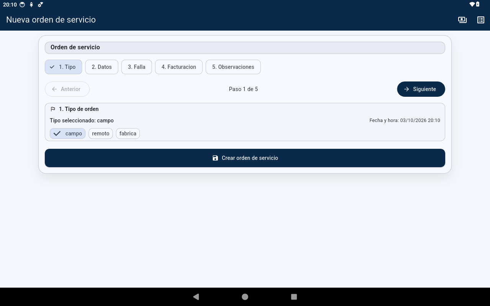

**Qué hacés:** en el paso **1. Tipo**, tocás **campo**.

**Qué responde la app:** "campo" queda marcado con un tilde y aparece en "Tipo seleccionado".

---

## Paso a paso

### 1. Entrar al paso 2

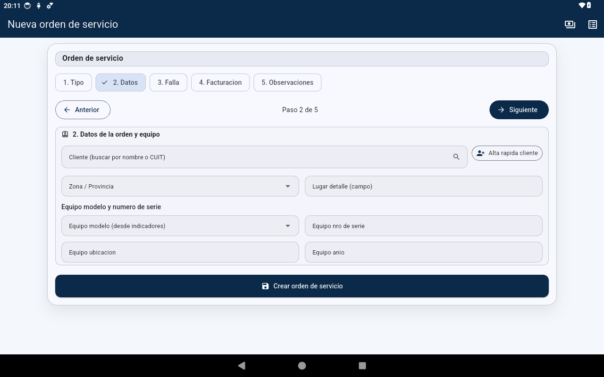

**Qué hacés:** tocás **Siguiente** o directamente el botón **2. Datos** de arriba.

**Qué responde la app:** muestra el recuadro **2. Datos de la orden y equipo** con estos campos:

- Cliente (buscar por nombre o CUIT) y el botón **Alta rapida cliente**
- Zona / Provincia y Lugar detalle (campo)
- Equipo modelo, número de serie, ubicación y año

Al abrir el paso puede aparecer arriba una barra fina que se mueve mientras se cargan las listas de zonas y modelos. Esperá unos segundos a que termine.

---

### 2. Buscar el cliente

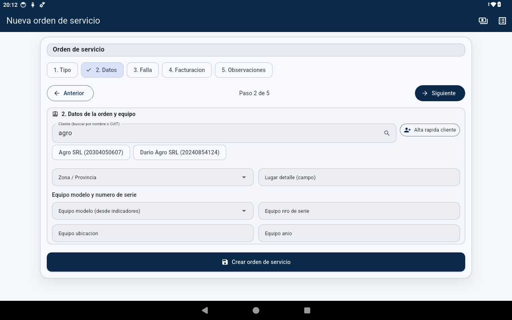

**Qué hacés:**

1. Tocás el campo **Cliente (buscar por nombre o CUIT)**.
2. Escribís una parte del nombre o el CUIT. Por ejemplo: `agro`.
3. Tocás la **lupa** o la tecla de confirmar del teclado.

**Qué responde la app:** debajo del campo aparecen botones con los clientes que coinciden, cada uno con su nombre y su CUIT entre paréntesis. Si hay muchos, podés deslizar la fila hacia los costados para ver el resto.

---

### 3. Elegir el cliente

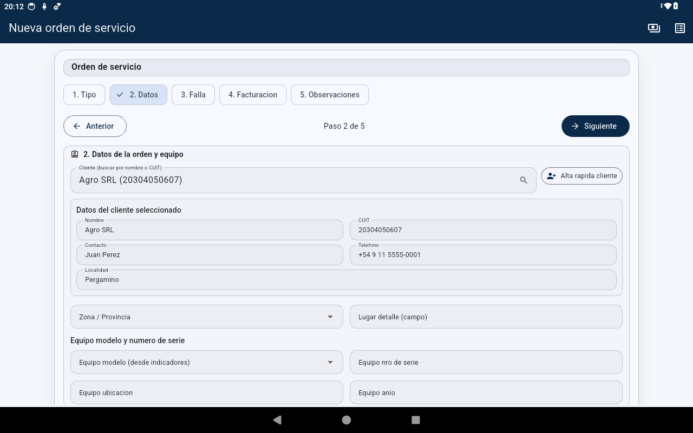

**Qué hacés:** tocás el cliente que corresponde.

**Qué responde la app:**

- El campo de búsqueda pasa a mostrar el cliente elegido. Por ejemplo: "Agro SRL (20304050607)".
- La lista de resultados desaparece.
- Aparece el recuadro **Datos del cliente seleccionado** con nombre, CUIT, contacto, teléfono y localidad. Si al cliente le falta alguno de esos datos, figura como "No informado".

Estos datos son solo para que los controles: desde acá no se pueden modificar.

**Para cambiar de cliente:** borrá lo que dice el campo de búsqueda, buscá de nuevo y elegí otro.

Si encontraste al cliente, seguí en el [punto 5](#5-elegir-la-zona-o-provincia).

---

### 4. Si el cliente no existe: darlo de alta

#### 4.1. Confirmar que no está cargado

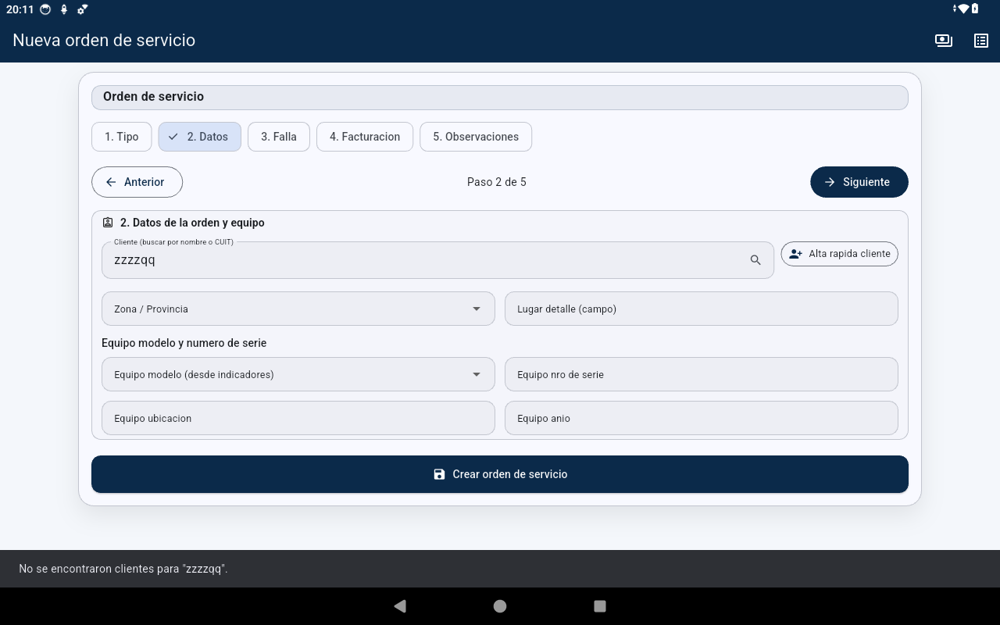

**Qué hacés:** buscás el nombre o CUIT del cliente.

**Qué responde la app:** si no lo encuentra, abajo aparece el aviso **No se encontraron clientes para "…"**.

Antes de crear un cliente nuevo, probá con otra parte del nombre o con el CUIT, para no cargarlo dos veces.

#### 4.2. Abrir el alta rápida

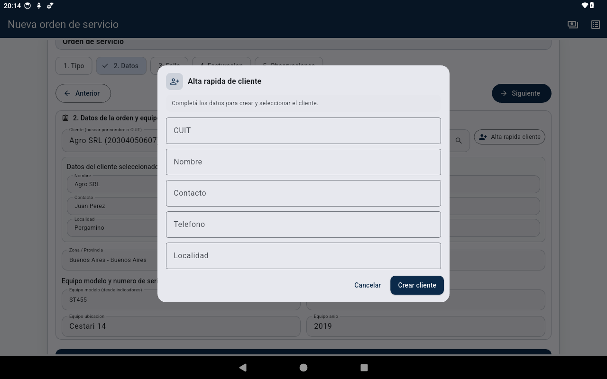

**Qué hacés:** tocás **Alta rapida cliente**.

**Qué responde la app:** se abre la ventana **Alta rapida de cliente** con cinco datos para completar.

#### 4.3. Completar los datos

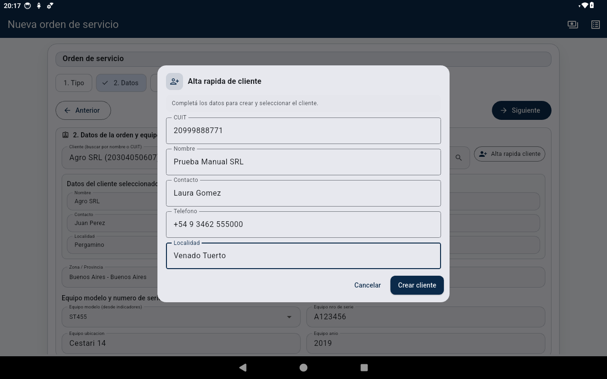

**Qué hacés:** completás los cinco datos. Todos son obligatorios.

| Campo | Qué poner | Ejemplo |
|---|---|---|
| CUIT | Solo números, sin guiones | 20999888771 |
| Nombre | Razón social o nombre del cliente | Prueba Manual SRL |
| Contacto | Persona con la que tratás | Laura Gomez |
| Telefono | Teléfono de contacto | +54 9 3462 555000 |
| Localidad | Localidad del cliente | Venado Tuerto |

Después tocás **Crear cliente**.

**Si falta algún dato:**

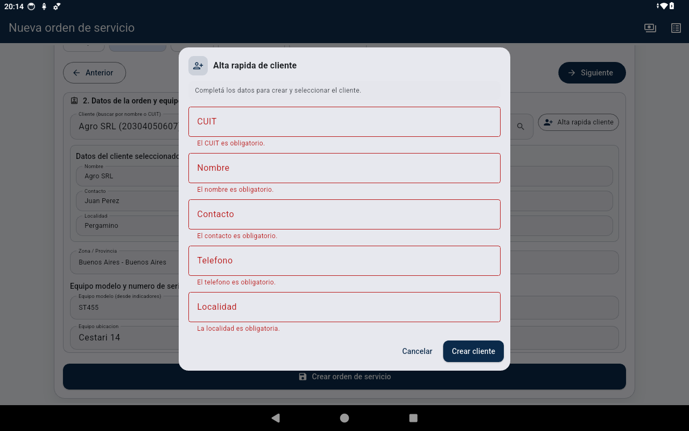

Si tocás **Crear cliente** con algún dato vacío, ese campo se pone en rojo y abajo aparece qué falta. Por ejemplo: "El CUIT es obligatorio." o "La localidad es obligatoria." Completalo y volvé a tocar **Crear cliente**.

#### 4.4. Cliente creado

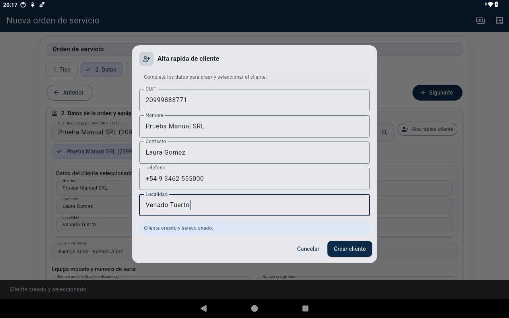

**Qué responde la app:**

- Dentro de la ventana y abajo de la pantalla aparece **Cliente creado y seleccionado.**
- Detrás de la ventana, el cliente nuevo ya queda **elegido en la orden**. No hace falta que lo busques.

**Qué hacés:** la ventana **no se cierra sola**. Tocás **Cancelar** para cerrarla: el cliente ya quedó guardado y cancelar no lo borra.

> **No toques "Crear cliente" otra vez.** El cliente ya existe y la app te va a mostrar el aviso del punto 4.5.

#### 4.5. Si el CUIT ya está cargado

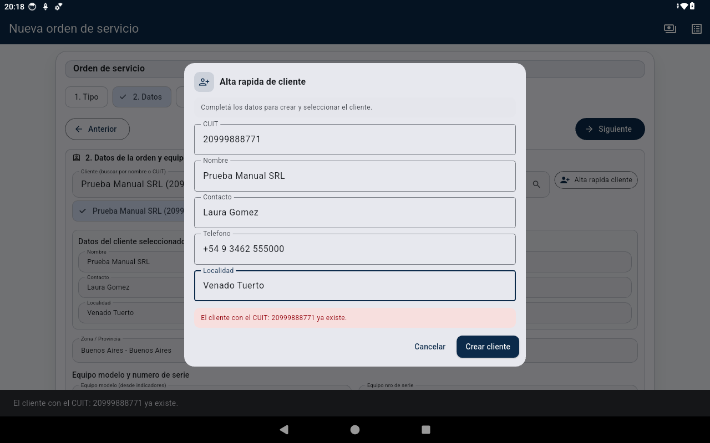

**Qué pasó:** intentaste crear un cliente con un CUIT que ya está registrado.

**Qué responde la app:** muestra **El cliente con el CUIT: … ya existe.** y no crea nada.

**Qué hacés:** tocás **Cancelar**. Después buscás al cliente por su CUIT (punto 2) y lo elegís.

#### 4.6. De vuelta en el formulario

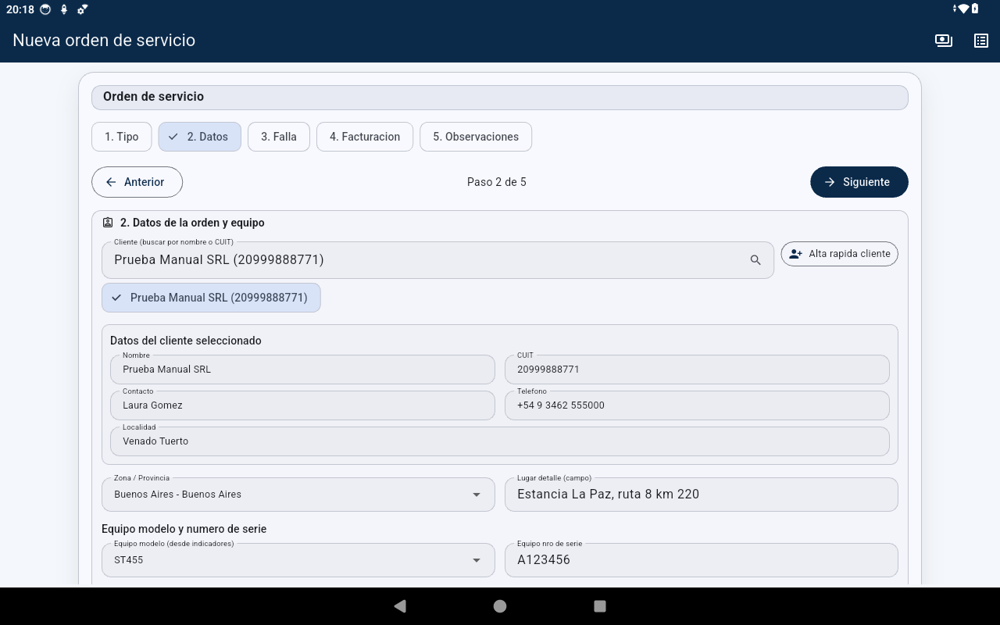

Al cerrar la ventana ves el cliente nuevo elegido: figura en el campo de búsqueda, marcado con un tilde debajo, y con sus datos en el recuadro **Datos del cliente seleccionado**.

---

### 5. Elegir la zona o provincia

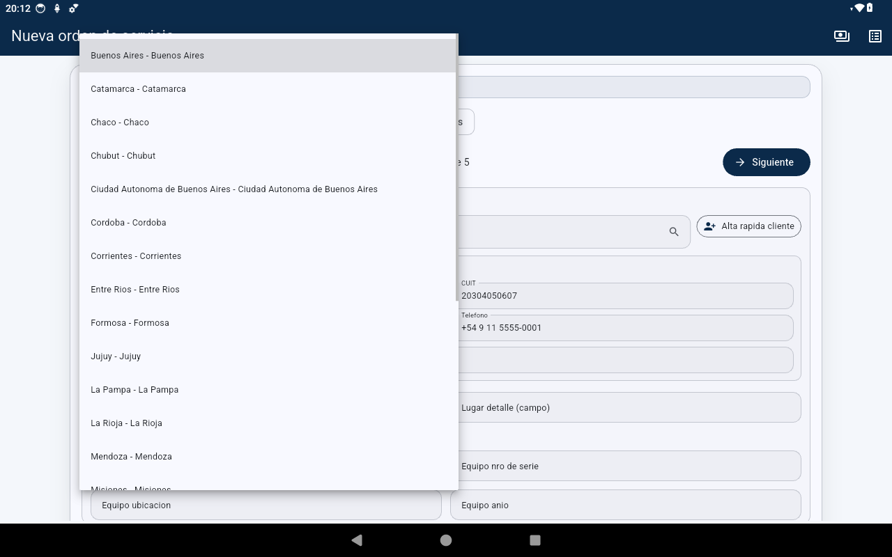

**Qué hacés:** tocás **Zona / Provincia** y elegís la que corresponde de la lista.

**Qué responde la app:** se cierra la lista y la zona elegida queda escrita en el campo.

---

### 6. Escribir el lugar

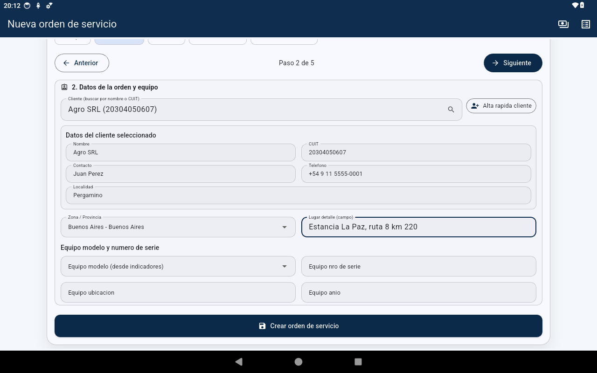

**Qué hacés:** tocás **Lugar detalle (campo)** y escribís dónde hiciste el trabajo. Por ejemplo: "Estancia La Paz, ruta 8 km 220".

**Qué responde la app:** guarda el texto a medida que escribís.

---

### 7. Elegir el modelo del equipo

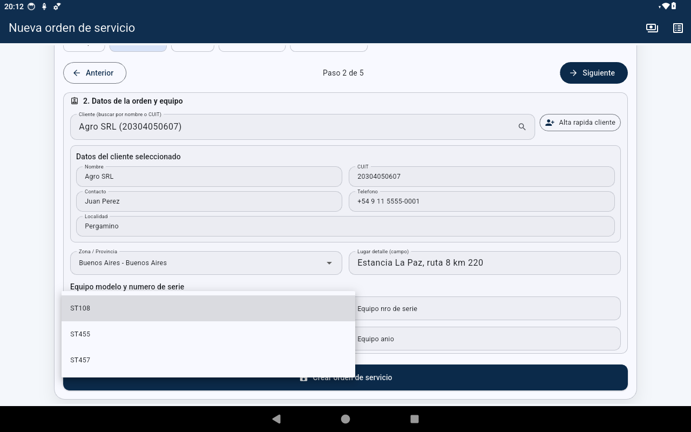

**Qué hacés:** tocás **Equipo modelo (desde indicadores)** y elegís el modelo. Por ejemplo: ST455.

**Qué responde la app:** el modelo queda escrito en el campo.

> Si en lugar de la lista aparece **No hay indicadores activos para seleccionar modelo.**, esperá unos segundos: puede que la lista todavía se esté cargando. Si el mensaje sigue, avisá al administrador, porque no hay modelos habilitados para elegir.

---

### 8. Completar número de serie, ubicación y año

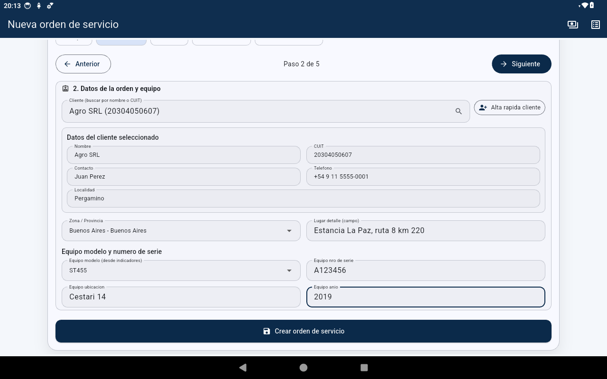

**Qué hacés:** completás los tres campos que quedan:

| Campo | Qué poner | Ejemplo |
|---|---|---|
| Equipo nro de serie | El número de serie del indicador | A123456 |
| Equipo ubicacion | Dónde está colocada la balanza | Cestari 14 |
| Equipo anio | Año aproximado del equipo, solo números | 2019 |

**Qué responde la app:** guarda cada dato a medida que lo escribís. Con esto el paso 2 está completo.

---

### 9. Pasar al paso siguiente

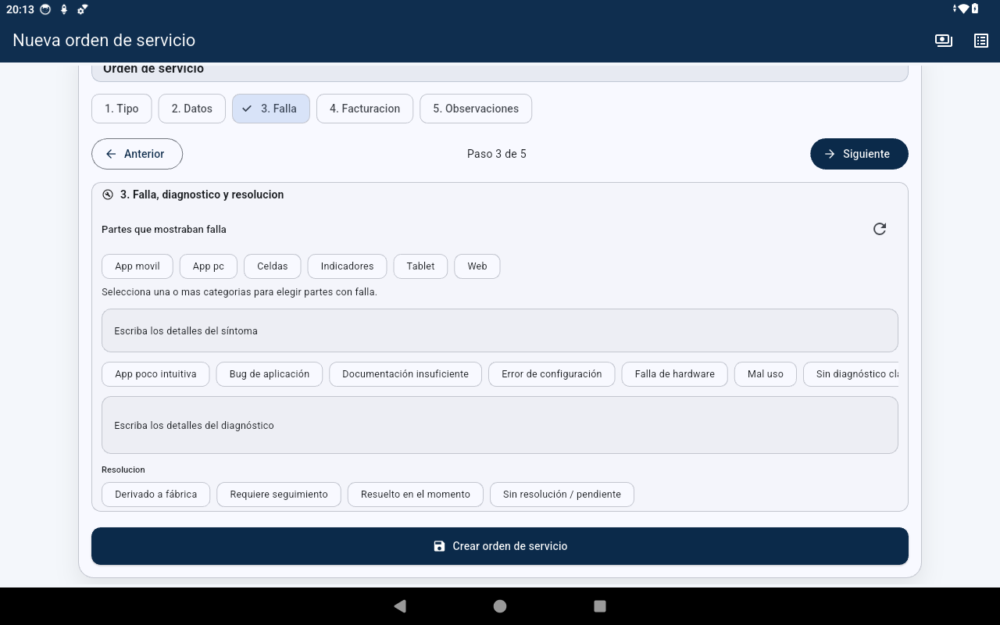

**Qué hacés:** tocás **Siguiente**.

**Qué responde la app:** pasa al paso **3. Falla, diagnostico y resolucion**.

- Con **Anterior** volvés al paso 1.
- También podés saltar a cualquier paso tocando los botones numerados de arriba.

Lo que cargaste **no se pierde** al moverte entre pasos.

---

## Avisos que pueden aparecer

Cuando tocás **Crear orden de servicio**, la app revisa la orden en orden, desde el paso 1 en adelante. Si encuentra algo que falta, muestra **un solo aviso**, el del primer problema que encontró, y no guarda la orden. Corregís ese dato y volvés a tocar el botón.

### Ejemplo: falta elegir el cliente

**Qué pasó:** tocaste **Crear orden de servicio** sin haber elegido cliente.

**Qué responde la app:** abajo aparece **Debes seleccionar un cliente.**

**Qué hacés:** buscás y elegís el cliente (puntos 2 y 3) o lo das de alta (punto 4).

### Ejemplo: falta el año del equipo

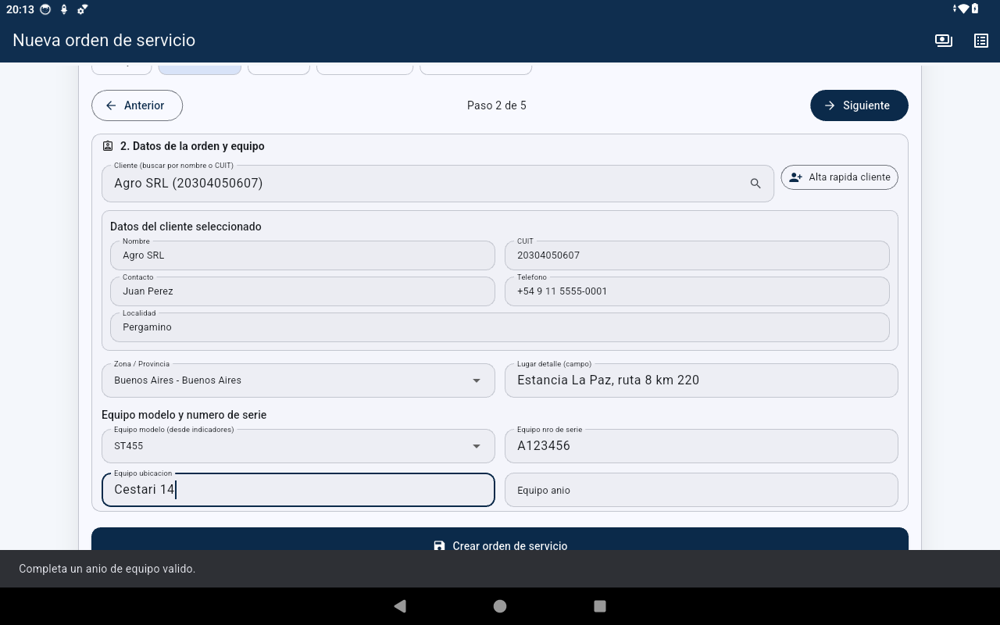

**Qué pasó:** todo estaba completo menos el año del equipo.

**Qué responde la app:** abajo aparece **Completa un anio de equipo valido.**

**Qué hacés:** escribís el año con números. Por ejemplo: 2019.

### Cómo saber que el paso 2 está bien

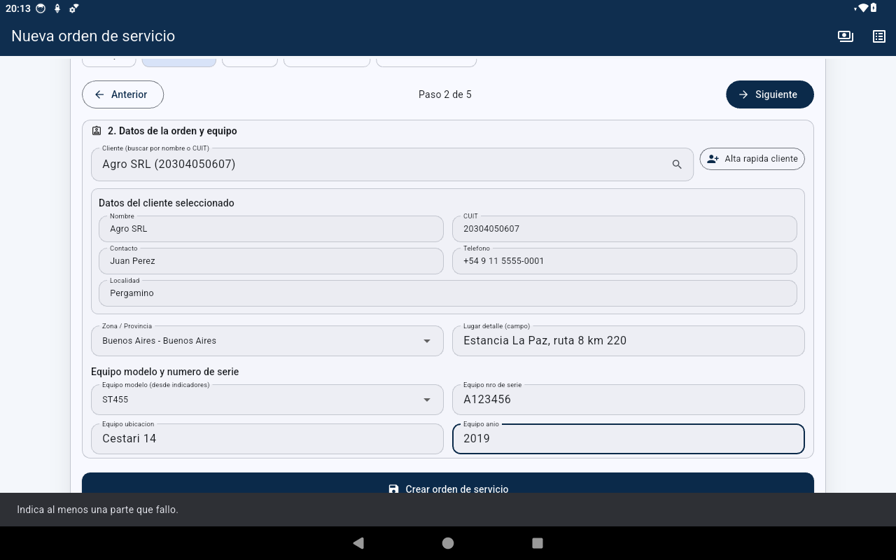

Si al tocar **Crear orden de servicio** el aviso ya habla de un dato de otro paso, el paso 2 está completo. Por ejemplo: **Indica al menos una parte que fallo.**, que corresponde al paso 3.

### Lista de avisos de este paso

| Aviso | Qué falta | Cómo se soluciona |
|---|---|---|
| Debes seleccionar un cliente. | No elegiste cliente | Buscalo y tocalo en la lista, o dalo de alta |
| Selecciona la provincia/zona del servicio. | Zona sin elegir | Elegí una zona de la lista |
| Completa el detalle del lugar. | Lugar vacío | Escribí dónde hiciste el trabajo |
| Completa el numero de serie del equipo. | Número de serie vacío | Escribí el número de serie del indicador |
| Completa el modelo del equipo. | Modelo sin elegir | Elegí el modelo de la lista |
| Completa la ubicacion del equipo. | Ubicación vacía | Escribí dónde está colocada la balanza |
| Completa un anio de equipo valido. | Año vacío, con letras o en cero | Escribí el año con números |

### Otros avisos

| Aviso | Qué significa | Qué hacés |
|---|---|---|
| No se encontraron clientes para "…". | Ningún cliente coincide con lo que escribiste | Probá con otra parte del nombre o con el CUIT, o dalo de alta |
| El cliente con el CUIT: … ya existe. | Ya hay un cliente con ese CUIT | Cancelá el alta y buscalo por su CUIT |
| No se pudieron buscar clientes. | Hubo un problema de conexión al buscar | Revisá la conexión y volvé a buscar |
| No se pudo crear el cliente. | Hubo un problema de conexión al dar de alta | Revisá la conexión y volvé a intentar |
| No se pudieron cargar los catalogos basicos. / No se pudieron cargar los productos. | No se pudieron traer las listas de zonas o modelos | Tocá **Reintentar catalogos** |
